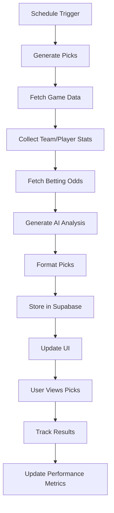

# Pick Generation and Storage Flow

## Overview
This document outlines the end-to-end process of how Gary 2.0 generates, stores, and displays betting picks. The system is designed to provide high-quality, data-driven betting recommendations with a premium user experience.

## 1. Pick Generation

### 1.1 Entry Point: `garyEngine.js`
- The process begins with a call to `generateGaryPicks()` in `garyEngine.js`
- This function orchestrates the entire pick generation workflow

### 1.2 Data Collection
1. **Upcoming Games**
   - Fetches scheduled games for the target date
   - Uses `sportsDataService` to retrieve game data
   - Filters out games that don't meet minimum criteria

2. **Team and Player Statistics**
   - Retrieves detailed team statistics using `ballDontLieService`
   - Collects player-specific metrics and recent performance
   - Gathers advanced analytics and historical data

3. **Odds and Betting Data**
   - Fetches current odds from `oddsService`
   - Analyzes line movement and betting trends
   - Identifies value opportunities based on statistical models

### 1.3 AI Analysis with OpenAI
- Packages the collected data into a structured prompt
- Sends the data to OpenAI's API for analysis
- Processes the response to extract key insights and picks

### 1.4 Pick Formatting
Each pick includes:
- **Teams**: Home and away team names
- **Bet Type**: Moneyline or spread (no over/under)
- **Confidence Score**: 1-100 scale indicating prediction strength
- **Analysis**: Detailed reasoning behind the pick
- **Key Metrics**: Supporting statistics and trends
- **Timestamp**: When the pick was generated

## 2. Pick Storage

### 2.1 `picksService.js`
The `savePicks` function handles storing picks in Supabase with the following flow:

1. **Data Validation**
   - Validates required fields
   - Ensures proper data types and formats
   - Checks for duplicate picks

2. **Database Operations**
   - Creates a new record in the `picks` table
   - Stores the complete pick object as JSON
   - Updates related team and game records

3. **Data Structure**
```typescript
interface Pick {
  id: string;                  // Unique identifier
  sport: string;               // e.g., 'NBA', 'MLB', 'NHL'
  league: string;              // League identifier
  game_date: string;           // ISO date string
  home_team: string;           // Home team name
  away_team: string;           // Away team name
  pick_type: 'moneyline' | 'spread';
  pick_team: string;           // Team to bet on
  pick_value?: number;         // Spread value if applicable
  confidence: number;          // 1-100 confidence score
  odds: number;                // Current odds
  analysis: string;            // Detailed analysis
  key_metrics: Record<string, any>; // Supporting statistics
  created_at: string;          // ISO timestamp
  updated_at: string;          // ISO timestamp
  status: 'pending' | 'win' | 'loss' | 'push' | 'no_contest';
}
```

### 2.2 Error Handling
- Implements retry logic for failed operations
- Logs all database interactions
- Maintains data consistency with transactions

## 3. Display on Pick Cards

### 3.1 `RetroPickCard` Component
The `RetroPickCard` component is responsible for displaying picks with a premium UI:

1. **Header Section**
   - Team logos and names
   - Game date and time
   - League/sport indicator

2. **Betting Information**
   - Bet type with clear visual indicators
   - Current odds and line movement
   - Confidence meter with color coding

3. **Analysis Section**
   - Key insights and statistics
   - Visual charts for trends (when applicable)
   - Historical performance context

4. **Premium Styling**
   - Gold accent colors for premium feel
   - Subtle animations on hover
   - Responsive design for all devices

## 4. Data Flow Diagram



## 5. Error Handling and Monitoring

### 5.1 Error Types
- **API Failures**: Retry logic with exponential backoff
- **Data Validation**: Graceful degradation when data is incomplete
- **Rate Limiting**: Backoff and requeue when rate limited

### 5.2 Monitoring
- Tracks success/failure rates
- Monitors API response times
- Alerts for critical failures

## 6. Performance Considerations

### 6.1 Caching
- Implements multi-level caching for:
  - Team/player statistics (5 min TTL)
  - Game data (15 min TTL)
  - Betting odds (1 min TTL)

### 6.2 Optimization
- Batch processing of similar requests
- Parallel data fetching where possible
- Lazy loading of non-critical data

## 7. Security

### 7.1 Data Protection
- Encrypts sensitive data at rest
- Implements proper CORS policies
- Validates all inputs to prevent injection

### 7.2 API Security
- Rotates API keys regularly
- Implements rate limiting
- Monitors for suspicious activity

## 8. Future Enhancements

### 8.1 Planned Features
- User-specific pick customization
- Advanced filtering and sorting
- Push notifications for new picks

### 8.2 Technical Debt
- Consolidate duplicate service logic
- Improve test coverage
- Enhance documentation

## 9. Conclusion
This document provides a comprehensive overview of the pick generation and storage process in Gary 2.0. The system is designed to be robust, scalable, and maintainable while delivering a premium user experience.
